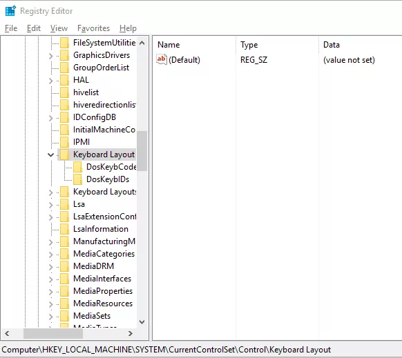
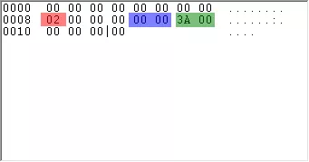

Source: https://isenselabs.com/posts/keyboard-key-kills-and-remaps-for-windows-users

Once you have accessed the ‘Registry Editor’, navigate to HKEY_LOCAL_MACHINE/SYSTEM/ then choose CurrentControlSet/Control/ and select the ‘Keyboard Layout’ folder. Provided you have no remaps, the window should look something like this:


```
Windows Registry Editor Version 5.00

[HKEY_LOCAL_MACHINE\SYSTEM\CurrentControlSet\Control\Keyboard Layout]
"Scancode Map"=hex:00,00,00,00,00,00,00,00,02,00,00,00,5b,e0,38,e0,00,00,00,00
```
I got the HEX Codes from Sharpkeys.




→  The first line consists of sixteen zeros, which you may ignore, since they do not have a significant meaning but should be there, so you must not skip them.

→ The ‘02’ in  red  represents how many remaps there will be plus 1. Since we are doing a single remap now, we set it to 2. If you were to do 4 remaps, you would use ‘05’.

→ Then you have 6 more zeros and we get to the part in  blue . This is the scancode of the key we are mapping TO (find scancodes of all keys in the link below). Since we want to kill the ‘Caps Lock’, we are using ‘00 00’, which is a scancode of a non-existent key. Therefore, it will disable (kill) the ‘Caps Lock’ key.

→ Right after that is the part in  green . This is the scancode of the key we are mapping FROM. In this case, the ‘Caps Lock’ key. Its scancode is ‘3A 00’.

→ The next 8 zeros should always be what you are ending with, since they act as a null terminator, a sign for the computer that the command is over.

Find scancodes of most keys here: [Microsoft ](https://msdn.microsoft.com/en-us/library/aa299374(v=vs.60).aspx)\
https://msdn.microsoft.com/en-us/library/aa299374(v=vs.60).aspx


.gif)
.gif)
